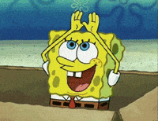

<br />


This article is inspired by CWK's article, which uses an object-oriented way of thinking as a life principal.

Using abstraction and encapsulation for effective learning strategies and maintaining cool-state-of mind.
Personally, writing this article helps me to self-reflect.

To open this article to the public is a little embarrassing for me(I think I'm not the level of who can teach others).
But it'll be good if it can help inspire the others who are willing to or ongoing similar journey.

Moreover, it is to express gratitude to my teacher, CWK 대두족장.
You give me a lot of inspiration now in my youth!


# Introduction

This article is inspired by CWK's article, which uses an object-oriented way of thinking as a life principal.

Using abstraction and encapsulation for effective learning strategies and maintaining cool-state-of mind.
Personally, writing this article helps me to self-reflect.

To open this article to the public is a little embarrassing for me(I think I'm not the level of who can teach others).
But it'll be good if it can help inspire the others who are willing to or ongoing similar journey.

Moreover, it is to express gratitude to my teacher, CWK 대두족장.
You give me a lot of inspiration now in my youth!


# start

imagine. if u are Sculpting a statute

with the time and effort for exhibition at louvre museum. Wow! what a good chance..!!


You draw upon a lifetime of experiences, travels, and profound insights gained from observing the world and its people. your every move imbued with your deepest philosophical reflections.

But, after u complete it, u realize that the statute you've made does not match the mood of the Louvre Museum.


Oops!


The Louvre Museum officials who saw your work decided to remove you from the list.

You have been too absorbed in your own world, thus forgetting to Look out the wide picture.

Haha, it was just kidding.

But, This kind of mistake actually occurs in real life, very often(including myself).
Because people don't know how to use abstraction and encapsulation for wide-view and effective learning.

You better read this article first before you read it.
:

- https://x.com/WankyuChoi/status/1821010857977090325

- https://github.com/neobundy/Deep-Dive-Into-AI-With-MLX-PyTorch/blob/master/book/sidebars/object-orientation-made-easy/Object-Orientation-Made-Easy.md


This article explores the importance of abstraction and encapsulation in effective learning and problem-solving.
Through various examples, we'll demonstrate how maintaining a broad perspective can lead to more efficient and successful outcomes. Here's what we'll cover:

1. Example 1: Gaming Strategies - Unlocking the Big Picture
   - Example: 대두족장's approach to Zelda and Elden Ring


2. Example 2: Artistic Process - Balancing Detail and Overall Vision
   - Example: Dr. Bono's drawing lecture
   - The pitfalls of focusing on details too early
   - Applying artistic principles to general learning and project management


3. Example 3 : Understanding Zeitgeist with Robert Green
   - Example: Robert Green's analysis of crisis-era thinking
   - Recognizing patterns in societal behavior and thought
   - The importance of historical context in understanding current events


4. Example 4: Seven Blind Mice by Ed Young - The Limitation of Human Processing Power
   - How the story illustrates human limitations in perception and understanding
   - Brief overview of related philosophical concepts (Kant, Heidegger, Hegel)
   - The importance of multiple perspectives in grasping complex ideas


5. Personal Application: Navigating AI and Math Learning
   - Applying the concepts to personal learning challenges
   - Strategies for maintaining perspective in complex fields of study

6. Self-Reflection and Improvement
   - The importance of explaining concepts to solidify understanding
   - Recognizing the difference between feeling productive and being productive
   - Strategies for clear thinking and effective learning

Through these examples and discussions, we'll explore how abstraction and encapsulation can be powerful tools for learning, problem-solving, and maintaining a balanced perspective in various aspects of life.


# Example 1: Gaming Strategies - Unlocking the Big Picture

When 대두족장 plays Zelda, or Elden Ring, first, he unlocks all the maps.

##### before unlock all the maps


##### unlocking maps...


##### after unlock all the maps


In Elden Ring, **you can fast travel to any Site of Grace that you have previously touched**. Once you activate a Site of Grace in the world, its location is marked by a golden icon on your map. You can open your map by pressing the "Back" button on the controller, or "G" on the keyboard.

### fast travel
Before starting to explain the reason for unlocking all the maps first, you have to know what 'fast travel' is.
##### Fast travel in Elden Ring
https://youtu.be/2-hOMhFF088?si=dEUwIAYsPnpOgNxI&t=8

##### Fast travel in Zelda : Tears of the Kingdom
https://youtu.be/AEpIXRRuypI?si=J4-8ZoTJjiEsu8Ck&t=177


### The resone he first unlocks all the maps

#### ex1 dealing with **Crystalians** 


In games, there are often situations where some monsters can easily be Defeated with a specific weapon, but you can't get that weapon in a nearer area.


##### sword
https://youtube.com/watch?v=Dxdffpklp88&t=52s

##### speir, and staff
https://www.youtube.com/watch?v=yRb4hisqF3A


---
with sword, speir, and staff, you only damage it little amount. but the hammer is different!

##### hammer
https://youtu.be/8RFO3w2yTmU?si=SyuOJRd0L4h8cGgb&t=25


imagine you dealing with Crystalians with sword. it is heard!  


#### Another example in elden ring

if you start with elden ring, and u wonder 'What bulid tree is more fun?'

- Wanna be a magician?
You can melt your enemies like ice cream with magnificent and massive magic!
https://www.youtube.com/watch?v=MbjBBubf24M

- Do u want stylish combat?
-you can be a samurai that skillfully defeats the enemy with your excellent reflexes!
https://www.youtube.com/watch?v=9EQFfPbIfes


or maybe you can't decide yet...

To know that, you have to explore and experience all the general build, and choose one of'em!


### Fast travel in real life = 24xN
so, what if you can 'fast travel' in your life..?

this concept can be applied in different fields!
U can use fast travel to 'the other domain that you already know!'


### summery


- **abstraction**: the unlocked map of the whole area

- **encapsulation**
	programmer doesn’t store all the information in their head. only do when they need it. they only do indexing, and if they don’t need it, they forget.
	like programmers do, you don’t have to clear all the areas on the map. if you need some weapon in that area, or when you have an interest in it, you can go to that area.


# Example 2: Artistic Process - Balancing Detail and Overall Vision

I recommend u to watch full 6 min.
https://youtu.be/16EdvZNn7d0?si=izxKPs2XqY2tbr0U


```
at 2:21

미련을 가지고 사소한 것에 집착하고 가다듬는 것은 문제가 있어요. 이런 분들은 특징이 뭐냐면, 그림이 망가지는 것은 죽도록 싫고, 당장 눈 앞에 있는 것 깔끔하게 해서
“아 난 다 했다, 드디어 해결했다” 이 느낌을 빨리 받고 싶거든요.

한수 앞, 두수 앞 , 내가 브러쉬를 200번 칠하고 나서 나오는 결과물들을 예상하고, 가장 효율적인 길을 가져야 되는데,  2번, 4번, 100번, 200번... 이게 뭐야?
지금 당장 선 그어서 깔끔한 것만 보고 싶은 거예요. 앞날은 못 보는 거죠.

그러니까 작은 것에 집착하다 보니까 전체적인 것 보고 전체적인 걸 못 보다 보니까 전체적으로 보면 딱히 변화하는 것이 없죠.

어 처음부터 다짜고짜 깔끔하게 다듬는 분들은 그림이 정말 많이 안 늘어요. 그림이 안 느는 케이스 중에서 가장 안 느는 케이스에요.
```

Based on the lecture script, here are the core principles for drawing:

1. Start with the big picture:
    
    - ==Begin by sketching the overall shape and composition==
    - ==Focus on the entire image before refining details==
    - ==Avoid getting caught up in perfecting small areas too early==
2. Build in layers:
    
    - Gradually develop the drawing, starting with rough shapes
    - Add more detail and refinement in subsequent layers
    - Don't try to achieve a perfect result in one go
3. Maintain a broad perspective:
    
    - Constantly evaluate the entire composition
    - Consider how different elements relate to each other
    - Avoid fixating on individual parts at the expense of the whole
4. Be willing to make changes:
    
    - Don't become too attached to early work
    - Be prepared to adjust and modify as needed
    - Prioritize overall quality over preserving specific details
5. Refine at the end:
    
    - Save detailed refinement for the final stages
    - ==Focus on getting the fundamental structure right first==
    - Use cleaning up and polishing as the last step, not the first
6. Practice efficiency:
    
    - Consider the most effective way to achieve the desired result
    - Don't waste time on unnecessary detailing early on
    - ==Think about long-term progress rather than short-term perfection==

By following these principles, artists can avoid common pitfalls such as getting stuck on details too early, losing sight of the overall composition, and being reluctant to make necessary changes. This approach promotes more efficient and effective drawing practices.

### summery

- **abstraction** : in earlyer process, you don’t have to(and better not to) think about detalis. that is information hiding.

before when you need to do something in detail, it is better not to touch it, and interact only with the “interface.”

+) Using imagination, you’ll know the interface not only the use of your cellphone but all of the objects. ex : abstract thinking.. etc.

+) Every object can be inheritance, abstraction, encapsulation, and polymorphism as their property.


---
so,
when you do abstraction on something, you need to encapsulate detailed information.

---
 - encapsulate
In Python, there is a library called “HTTPX” which can help interact with the internet inside the code.
you don’t need to understand “every source code” of it.

in other domains, you have to encapsulate details yourself. These are not familiar things the most people, so u need to practice it (so do I.)

### in addition

How can I determine which boundary is the big picture, and what are the details?

well, it is a tricky question depending on the field.

This video can help u.

:

https://drive.google.com/file/d/1-9YHT0oBvYy4e1mFvD2f4TdVBWOXp0lf/view?usp=sharing

Generic means the normal ways, that most people(technically, 95% of that distribution) in that field choose.
If u want the way that fits to u, you have to make your own syllabus.
This is the thing that others can’t help you. because U r the master of Your universe. To get inspiration more, check out it

:

https://drive.google.com/file/d/1H7N9L6KA2m391Zad3HYpISgyC9G6DqY3/view?usp=sharing


you have to listen to your inner voice(not the bad one) which, also, many people find hard to try.

Well...

- Kanye west : Graduation

https://www.youtube.com/watch?v=Gazq7znfdH0

- movie ikiru :
https://en.wikipedia.org/wiki/Ikiru


# Example 3 : Understanding Zeitgeist with Robert Green

again, I recommend u to watch full video.
https://www.youtube.com/watch?v=D6nVo_1kG5w


### The pattern of The Crisis Generation

14 38 to 17: 50
these are the kind of qualities that emerge in this crisis generation
:

##### 1. Individual and Collective Purpose

In my book "Mastery," I talk about the importance for an individual to have a deep and profound connection to their own sense of calling, to their own kind of life's task that guides them through life. But a collective, a society, also needs that kind of sense of purpose. We are united around a particular ideal, and this is what's guiding us. There's something higher than just our individual existences.

##### 2. The Onset of Collective Madness

But when this idea, this purpose, starts to fritter away and people lose it, a kind of collective madness ensues. People go nuts, they go literally crazy, and we notice all kinds of symptoms of this madness.

##### 3. Symptoms of Societal Decay

###### - Knee-jerk Patriotism

For instance, there becomes a sort of knee-jerk patriotism, this kind of parody of ideas that maybe were fresh in the very beginning but they've all become sort of dead. ==It all becomes just about believing so strongly in patriotism, in the nation, in the religion, but it has no spirit behind it. There's no freshness, there's no new ideas. It's just about mimicking and imitating the values that people are trying to promote.==

###### - Factions and Narrow Viewpoints

Then we see the creation of all kinds of cliques and factions, and each little faction seems to have its own little interpretation of what is really going on in the world, a kind of narrow viewpoint of reality. ==This gives a group that belongs to the faction a sense of its own cohesion and its own unity and its own purpose, but it's all very false because it's based on a very narrow interpretation of history, a very narrow interpretation of what's going on. It's not connected to the overall picture, it's not connected to the group as a whole.==

###### - Conspiracy Theories

We also notice all kinds of conspiracy theories starting to sprout up like mushrooms. ==Where people, instead of seeing the connections of all the little dots that connect about what is happening in the world, they create their own kind of connections in a kind of group paranoia.== And so conspiracy theories become very popular in moments like this.

###### - Disconnection from Historical Context

==People have become divorced from any kind of historical context. They imagine that what's happening in the world is just something new and never happened before.== So for instance, if you have no understanding of the history of race in the United States, of what it was like to be black in the 30s and 40s and 50s and the intense racism that was existing at that time, you can imagine now in the present that things are fine, that you know actually we've made so much progress and that people are just complaining for no reason.

###### - Misplaced Belief in Technology

The same thing happens with beliefs in technology, as if the phrase is "this time it's different." So it's different now with the internet, it's different now with social media, this has never happened before. But these kinds of things, it always seems like it's different. These kind of bubbles and these beliefs in technologies, this kind of religious fervor towards new forms of technology, have existed many times before.

##### 4. Contradictions and Power Grabs

Another thing that happens is that all kinds of contradictions start to emerge from within. So people are trying to promote freedom and diversity, and yet they want to tamp down anybody who might disagree with them - a complete walking contradiction. ==The belief in freedom and celebrating diversity, but shutting up anybody who might possibly disagree. The contradiction is so obvious, but people can't notice it in these times.==

And when things get so chaotic and so disjointed, also it works just like mushrooms as before: ==con artists and demagogues and all kinds of weird gurus are going to fill the emptiness that people are feeling with all kinds of new belief systems and new kinds of religions and cults. And the leaders that emerge, the con artist leaders that emerge, aren't really connected to any kind of ideas. It's really just about power itself and naked self-interest.==

---
##### 5. In addition
also, 
- in 'Underground' by Haruki Murakami, and 'Demons' by Dostoevsky has the same pattern.
Historical Context of Demons
:
Christianity starts to fall apart, and various new ideologies start to emerge.

- in the bible, the same pattern is suggested metaphorically as a 'false prophet'

---


### summery
you have to "feel" how much it terrifying when people are locked in a narrow viewpoint. it can't be understood as a rational insight but an emotional experience. to do this, you'll understand the importance of the effort to get a wide view.

so, if I explain it, that can't be helpful to u.

my recommend: 'Underground' by Haruki Murakami


### Example 3-1 : sampling error 

imagine, You are a data scientist, and what if the value of the distribution is 1 or too small?

https://www.youtube.com/watch?v=Mg0EASrWl-Y


# Example 4: Seven Blind Mice by Ed Young - The Limitation of Human Processing Power

take it as an interesting example. if u can, just enjoy it.


Seven Blind Mice is a children's picture book written and illustrated by Ed Young. Based on the Indian fable of the blind men and an elephant, the book tells the story of seven mice who, each day, explore and describe a different part of the elephant


english
https://www.youtube.com/watch?v=yI-2b9pR2MA

korean
https://www.youtube.com/watch?v=dp0pMYdXzHw


that fairy explain the humans limitation of processing power.


- **Immanuel Kant** suggested the concept of 'thing in itself'(kor : 물자체)

According to Kant, the "thing-in-itself" refers to the reality that exists independently of our perception or understanding. It is the true nature of an object, which is unknowable to us because our understanding of the world is limited by our sensory experience and the categories of our understanding.

For example, we can perceive a chair through our senses, understanding its shape, color, and texture. However, according to Kant, we cannot know the chair as it truly is, independent of our perception. The "thing-in-itself" is the chair's true nature, which exists outside of our sensory experience and conceptual understanding.

however, interprete thing as ''thing in itself'' is impossable.
it is the same as a vanishing point, if you get closer as one step, it'll run away as one step.


- **Heidegger**'s theory of interpretation

Heidegger's theory of interpretation suggests that humans understand and interpret objects based on their own context, background, and purposes. The famous example of a hammer and a nail illustrates this idea well.

When we encounter a hammer, we don't simply see it as an isolated object with certain physical properties. ==Instead, we interpret it in terms of its use and its relation to other objects and activities.== 

- For someone engaged in carpentry, a hammer is understood primarily as a tool for driving nails into wood. The hammer's meaning is determined by its role within the context of the carpenter's work.
- For someone playing elden ring, a hammer is generally have high base damage, have a slower attack speed and excellent weapon at breaking enemy stances.

==However, if we change the context, the interpretation of these objects can shift.==
=> 24xN


- **Hegel**'s Dialectic


Hegel's Dialectic is a philosophical concept that explains the progression of ideas and historical events through the process of thesis, antithesis, and synthesis. This process is seen as a continuous cycle, where each synthesis becomes a new thesis, which then faces a new antithesis, leading to another synthesis, and so on.

Let's consider an everyday example of choosing what to eat for dinner:

- Thesis: You want to eat a healthy, homemade meal for dinner. You believe that cooking a balanced meal with fresh ingredients is the best option for your well-being and health.

- Antithesis: However, you've had a long, tiring day at work, and you don't feel like spending time and effort cooking a meal from scratch. You're tempted to order takeout or grab a quick, unhealthy snack instead, as it's more convenient and requires less effort.

- Synthesis: After considering both your desire for a healthy meal and your lack of energy to cook, you come up with a compromise. You decide to prepare a quick and easy meal using a mix of fresh ingredients and some pre-prepared items, like a salad kit or a rotisserie chicken from the grocery store. This way, you can still have a relatively healthy meal without spending too much time and effort cooking.

---
---


when we talk about Thesis and Antithesis, we often imagine two of the opposite object. 

as the perspective of humans often has misjudgment. (due to their limitation of processing power) often interpreted"'thing in itself'" as various things, such as "A snake!", "A rope!", "A fan!", "A cliff!"


so, Thesis and Antithesis are not opposites of two concepts but rather refer to differences of perspective.


---
---
#### Eception - the real genius

like elon musk, machiavelly, 니체, ect…
They are not the same as other blind mice. They can recognize the elephant at a glance.


Perhaps one day in the future, the white mouse will suddenly strike its knee and say something like this..


in another word, normal people like you and me(blinded mice), must have trial and error - apply and try to have a various perspective(hrizon=24xN) -  to grasp the big things like The elephant.  


### summery
i recommand u the movie 'rashomon'
	A priest, a woodcutter and a peasant take refuge beneath a ruined gate. They discuss the trial of a notorious bandit held for rape and murder, each narrating their own version of the tale.


in this part, there is no right answer!
just have fun with your imagination!



in blow parts, I used 'you' because I wrote it like talking to myself.


# Personal Application: Navigating AI and Math Learning

Application in my case

## current situation


I am studying ai. 
- I am poor at math, with no mathematical bases.
- i experienced python a litte. I made a general scraping project that can handle a large amount.
- I started it with Cwk's math book,
https://github.com/neobundy/Deep-Dive-Into-AI-With-MLX-PyTorch/tree/master/math-book
but I feel I have to understand the math-related ai solid, but it takes me quite a long time.

and I feel anxious doing it. I don't know where am I, and what I doing for what, i'm not sure this learning is necessary for ai.


## problem

1. the pattern of 대두족장 playing Elden Ring and Zelda
This situation can occur in my case. 
You have to solve some problems, with some specific concept. without the wide-bird-eye view of maps, you can't find the key to that problem.

== Before u discovering the specific area, u have to make a whole map first.==


2. the pattern of making a statute and drawing 
without a wide-abstract view(bird-eye-view), you could put your time and effort too much into something ==that is not very important.
this kind of situation can occur when you don't make an abstraction of the whole picture.


3. the pattern of the people of the crisis-era
without a wide-bird-eye-view of the map, I could go nuts! feeling more and more anxious, and due to anxiety, my judgment ablility gets worse, and so on...


## From now on, what can I do?

in general,
```
in some cases, you can dealing with that problem more easily, when you know which way is the most effective way.
To know that, first, you have to unlocks all the maps of the Field that you dealing with. 

if you don't follow that way, you lost in tiny-uselss things, get overwhelmed, and can't achieve your goal.


abstraction and incapsulation is a related concept. when you abstract on something, 
during that process, you encapsulate the thing that has low priority or high complexity.

```


1. if u encounter a math equation or concept, you must be aware 'i encapsulated it," and

2. search that concept on youtube or the internet.
if you look only '대두족장's explanation about it, you'll get lost.

you don't have to understand it completely, but 
you have to make a useful abstraction(interface).

To make a useful abstraction, u have to collect the information of that concept (why they are used in AI, )  and extract the inheritance pattern of it.


3. in the future, u'll have to unpack that encapsulated concept. to do this, U have to keep your awareness of darkness.
	to do this, you better make your 'encapsulated concept list'


# Self-Reflection and Improvement

Q: why didn't I explain the importance of abstraction and encapsulation?

##### 1.
Because I don't have a long term average 'The habit of explaining'.
in "when you decide to explain something or not, you have to re-explain the importance of explaining."

##### 2.
I realize that 'I tend to know it without real knowing.'
so I found that 'to test this(understanding - knowing or not)' I have to explain that thing.

again, 
without speaking or writing, You aren't using your brain.
I thought 'i know this!', but it was only a feeling of it.


##### 3. Feeling unproductive disturbed my clear thinking.

```
급할수록 돌아가라
```


you decided to study math too queck, because when you're doing nothing, feeling unproductive, that makes you creazy.
But, 'feeling productive' and 'real productive' is way different.
this uneasiness disturbs your clear thinking.

That could be a huge mass..! there were too many large holes..!

it is the same as blind driving..!
oh shit! that is **HIGHWAY TO HELL!!!**


https://www.youtube.com/watch?v=gEPmA3USJdI

[verse1]

Living easy, living free

Season ticket on a one-way ride

==Asking nothing, leave me be==

Taking everything in my stride

==Don't need reason, don't need rhyme==

==Ain't nothing I would rather do==
(U don't use your brain..!)

Going down, party time
My friends are gonna be there too

[chorus]

I'm on the HIGHWAY TO HELL!!

On the HIGHWAY TO HELL!!

HIGHWAY TO HELL!!

I'm on the highway to hell


<br />
